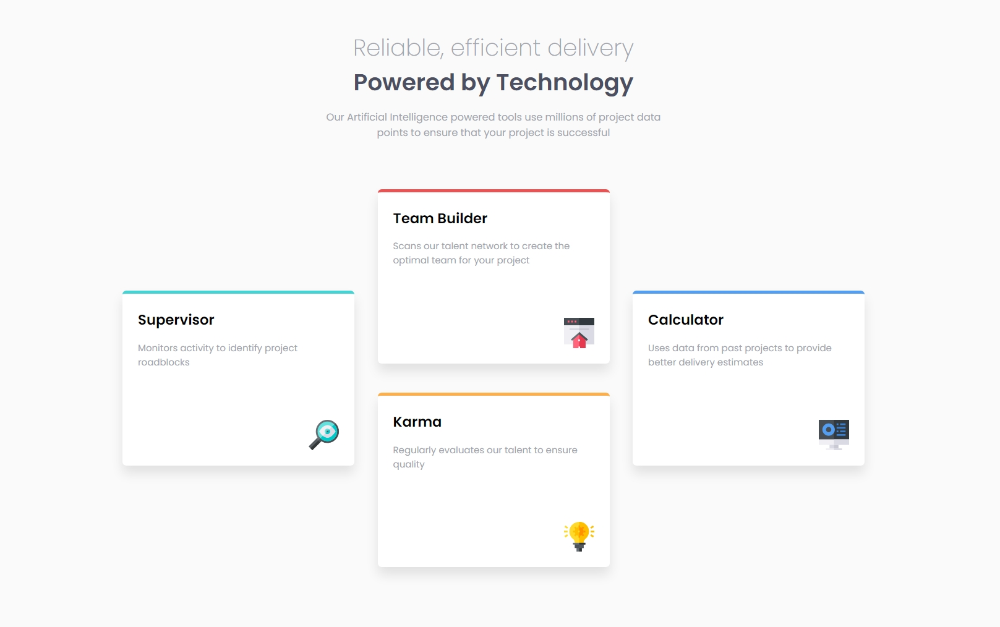
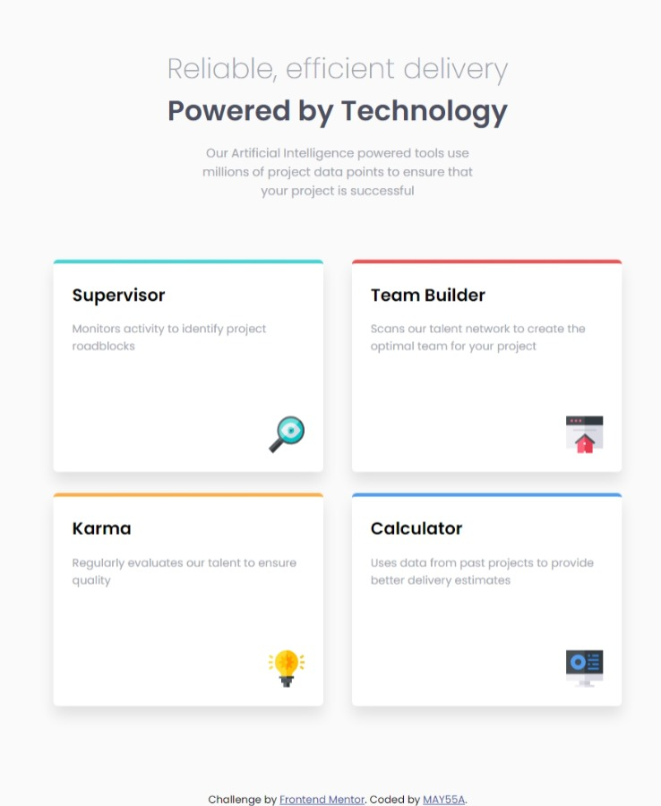
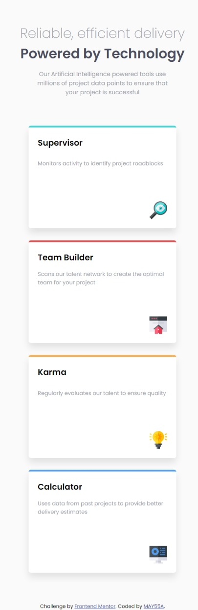

# Frontend Mentor - Four card feature section solution

This is a solution to the [Four card feature section challenge on Frontend Mentor](https://www.frontendmentor.io/challenges/four-card-feature-section-weK1eFYK). Frontend Mentor challenges help you improve your coding skills by building realistic projects. 

## Table of contents

- [Overview](#overview)
  - [The challenge](#the-challenge)
  - [Screenshots](#screenshots)
  - [Links](#links)
- [My process](#my-process)
  - [Built with](#built-with)
  - [What I learned](#what-i-learned)
- [Author](#author)


## Overview

### The challenge

Users should be able to:

- View the optimal layout for the site depending on their device's screen size

### Screenshots


On wide screens :



On medium-sized screens :



On small screens :



### Links

- Solution : https://www.frontendmentor.io/solutions/responsive-mobile-first-cards-layout-with-grid-kIdhBrIjhw
- Live Site : https://may55a.github.io/four-card-feature-section/

## My process

### Built with

- Semantic HTML5 markup
- Less
- Flexbox
- CSS Grid
- Mobile-first workflow


### What I learned

This is my first time using a css preprocessor "Less".
While it does make a lot of things easier, I did face some troubles especially in how to compile the less file, but then I ended up using a vs extension that auto compiles the less file to a css file on each save.
The most useful feature of a preprocessor is making functions or loops to avoid repeating the same code every time with minor changes. I used this feature to assign different grid areas and colors to the four section cards with one function :

```less
.generate-cards(@index: 1) when (@index <= 4) {
    @color: "color-@{index}";

    .card:nth-child(@{index}) {

        border-top: 4px solid @@color;

        grid-row: @index;
        grid-column: 1;

        @media screen and (min-width: 600px) and (max-width: 900px) {
            grid-row: extract(@rows-1, @index);
            grid-column: extract(@columns-1, @index);
        }

        @media screen and (min-width: 900px) {
            grid-row: extract(@rows-2, @index) / span 2;
            grid-column: extract(@columns-2, @index);
        }
    }

    .generate-cards(@index + 1);
}
.generate-cards();

```


## Author

- Website - https://may55a.github.io/Social-links-profile/
- Frontend Mentor - [@MAY55A](https://www.frontendmentor.io/profile/MAY55A)
- LinkedIn - [@Mayssa Ghanmi](https://www.linkedin.com/in/mayssa-ghanmi-a85369276)
